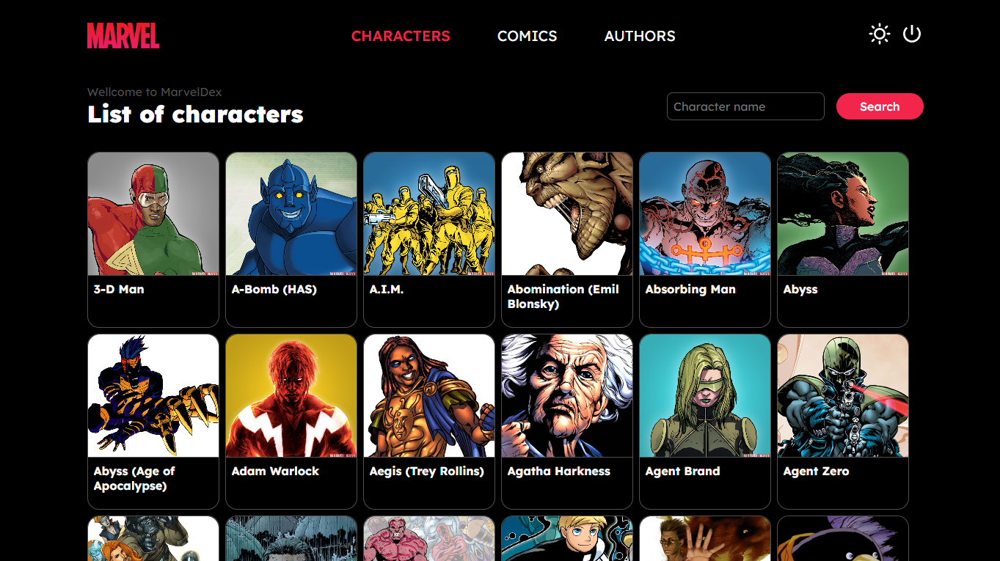

# MarvelDex

MarvelDex é uma aplicação que possui o objetivo de consumir a API da Marvel, trazendo listagens de heróis, histórias e autores, possibilitando, também, a filtragem por nome em cada página.

Deploy: [https://globo.com/](https://globo.com/)

## Stack utilizada:

Este projeto foi construído utilizando as seguintes tecnologias:

- ReactJS: para a criação de toda a interface das páginas;
- TypeScript: tipagem estática do código;
- axios: para realizar as chamadas à API.
- md5: função para a criação do hash das chaves + timestamp, exigido pela API.
- redux: armazenamento e gerenciamento de estados.
- react-router-dom: gerenciamento de rotas e navegação entre as páginas.

## Configurações iniciais:

1. É necessário possuir o NodeJS/npm instalado;
2. Clonar este [repositório](https://github.com/henriquescarv/marveldex);
3. Instalar as dependências utilizando o comando '_npm install_' (ou '_yarn_', se preferir);
4. Inicializar o projeto utilizando o comando '_npm start_' (ou '_yarn start_', se preferir);

## Navegação:

1. Acessar o site oficial da [API da Marvel](https://developer.marvel.com/documentation/getting_started) e obter as suas chaves pública e privada;
2. Realizar o _login_ através da rota '/login' da aplicação, utilizando as chaves obtidas;
3. Caso o acesso seja bem sucedido, a aplicação redirecionará você para a rota '/characters', com a lista de heróis retornada pela API.

## Desenvolvido por:

- [**Henrique Carvalho**](https://github.com/henriquescarv)
